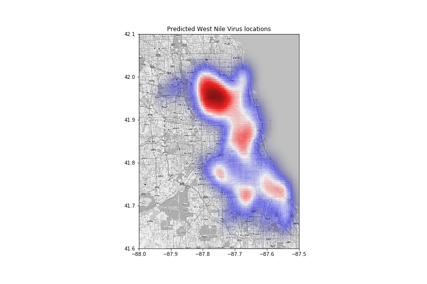
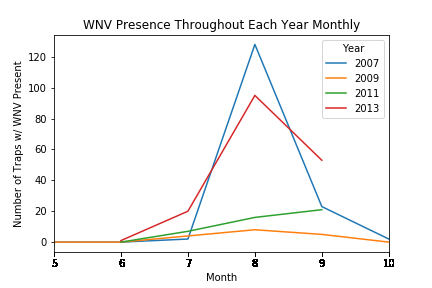
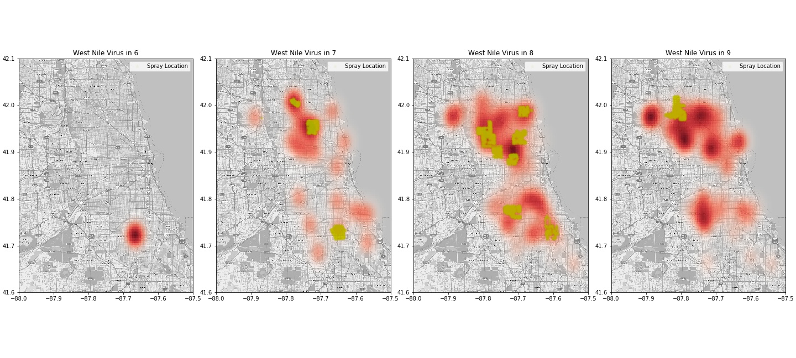
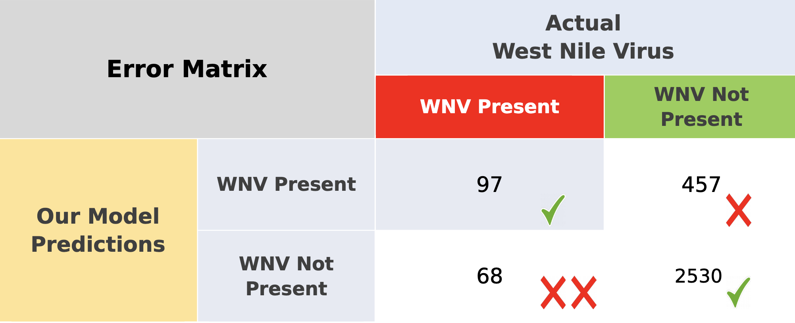

# Project-4
### West Nile Virus Prediction
### Predict West Nile virus in mosquitos across the city of Chicago
​
## Problem Statement:
West Nile virus is most commonly spread to humans through infected mosquitos. 
Around 20% of people who become infected with the virus develop symptoms ranging 
from a persistent fever, to serious neurological illnesses that can result in death.
​
We will predict a method of predicting outbreaks of West Nile virus in mosquitos 
so that the City of Chicago can more efficiently and effectively allocate resources towards 
preventing transmission of this potentially deadly virus.
​
## Objective:
    1. To predict mosquito hotspots in Chicago using our models.
    2. Propose solutions to stop and prevent these hotspots from breeding mosquitoes 
## Methodology:
With the given datasets, we linked up the datasets together and create models based on the relevant features
such as:  
    - temperature  
    - total precipitation  
    - species of mosquitos etc.  
    
We have also combined our data using Principal Component Analysis (PCA) on data that are highly correlated to
reduce the dimensionality of the data.
 
In terms of modelling, while we included Decision trees, Random Forrest in our selection.
More often than not, Logistic Regression, Adaboost or Gradient Boosting were the stronger models. (Details in materials)
 
With the predicted probabities, we have also ran a Cost Benefit Analysis to discuss further on the where 
resources of Chicago should go to prevent the virus.
 
## Constrains:
Based on this data alone, we are unsure where spraying are done in 2012 and 2014 and hence affects the prediction
of the potential rise in danger zones for the virus.
 
Absence of population density, urban / rural area, infection rates, infected population also prevented us to
analyse the data further to come up with more useful variables for the model.
 
There is no clear link between the spraying data & the event of WNV case present in the sprayed locations,
hence it could potentially affect the effectiveness of the model.
 
It is not predictable how mosquito spray impacts the West Nile virus. Variations in quality and quality of mosquito spray used and techniques used to apply the spray will affect the effectiveness of the mosquito control measure. We are also not given enough information about how effective all the types or type of spray used at deterring mosquitoes with West Nile virus. These limitations could create future studies to help Chicago combat the West Nile virus.
 
Additional data sources (bird populations, infectiousness among bird populations,and mosquito populations) are needed to truly understand the transmission cycle of WNV. This understanding would lead to better predictions of transmission intensity and thus inform mitigation strategies and ultimately reduce human cases. However, in the absence of these explicit models, our model is a tool for early warning and policy decision support.
 

## Materials:
### 1. Assets (Data files for which we used for analysis)
   There is a folder and raw csv files are within this folder.
   
|File name            | Description                                                                         |
|---------------------|-------------------------------------------------------------------------------------|
|Chicago Boundaries   | Images to plot city's map                                                           |
|.DS_Store            | Apple's directory file                                                              |
|combined_2.csv       | Combined and cleaned data from train and test data                                  |
|combined_3.csv       | Different version and style of combining and cleaning data from train and test data |
|full.csv             | final combined dataset with different treatment used in variables for modelling     |
|plot1.png            | Data visualisation (dew point, wet bulb, average temperature)                       |
|plot2.png            | Data visualisation (wind speed, average wind speed, wind direction)                 |
|plot3.png            | Data visualisation (heat, cool)                                                     |
|plot4.png            | Data visualisation (heat, cool, average temperature)                                |
|sampleSubmission.csv | A base template for all submission csv                                              |
|spray.csv            | Orginal spraying data in the city in year 2011 and 2013                             |
|spray_2.csv          | Cleaned data after EDA from spray.csv                                               |
|test.csv             | Original file from source, containing Trap collection data in years 2008/10/12/14   |
|test_2.csv           | Cleaned data after EDA from test.csv                                                |
|test_modified.csv    | Cleaned data after EDA from test.csv (features added)                               |
|train.csv            | Original file from source, containing Trap collection data in years 2007/09/11/13   |
|train_2.csv          | Cleaned data after EDA from train.csv                                               |
|train_modified.csv   | Cleaned data after EDA from traint.csv (features added)                             |
|weather.csv          | Original file from source, containing weather data from 2007 to 2014                |
|weather_2.csv        | Cleaned data after EDA from weather.csv                                             | 

### 2. Codes
The project details, codes and submission csv are within this folder
    
|File name            | Description                                                                         |
|---------------------|-------------------------------------------------------------------------------------|
|submission           | Multiple csv for submission to Kaggle                                               |
|.DS_Store            | Apple's directory file                                                              |
|1.0 EDA              | Data cleaning, simple visualisation to understand the data, manipulation of data and combining the data for future uses|
|2.0 Baseline         | Creating a baseline submission using all zeros as prediction                        |
|2.1 Data Modelling   | Preprocessed at the previous stage, AdaBoost was the best model and 0.89 roc_auc score|
|2.2 Data Modelling   | Removed Mosquitoes as a predictor, followed by AdaBoost and 0.85 roc_auc score, but did better in Kaggle submission|
|2.3 Data Modelling   | Refresh EDA portion, selected less variables, did PCA on weather variables, followed by RandomForest model and 0.87 roc_auc score|
|2.4 Data Modelling   | TL;DR Best model. Similar to 2.3 with minor edits such as reinstating weather code variables etc, used LogisticRegression model with a 0.80 roc_auc score|
|2.5 Data Modelling   | Lagged weather data, did an "event over sampling", followed by a GradientBoosting model with 0.83 roc_auc score, but didn't do as well as previous model |
|2.6 Data Modelling   | Did an "event over sampling" then applied some classification models                |
|3.0 CBA              | Cost-Benefit Analysis on Spraying vs Not Spraying                                   |
|heatmap.png          | To visualise the traps and hotspots for virus                                       | 

## Recommendation & Conclusion:
 ### Modelling & Prediction
​
For the best model, the best features were characterized by Principal Component Analysis (PCA) to uncover grouping among features and to understand the data variance. The features chosen for the model were: 
    - Latitude 
    - Longtitude 
    - Daylight [new feature] 
    - Species [dummied] 
    - CodeSum [dummied] 
    - PCA 1 ['Tmax', 'Tmin', 'Tavg', 'Depart','DewPoint', 'WetBulb', 'Heat', 'Cool']  
    - PCA 2 ['PrecipTotal', 'StnPressure', 'SeaLevel', 'ResultSpeed', 'ResultDir','AvgSpeed']  

The entire set of data was then entered into multiple statistical models to predict the number of moquitoes for the various locations followed by the probability of where in Chicago we would expect to find West Nile Virus. 
To classify which location could possibly have the virus, we used statistical classification models such as Logistic Regression, Gradient Boosting Classifier, Random Forest Classifier, XGBoost Classifier, and Support Vector Machine Classifier.
 
The report finds the best model is Logistic Regression with ROC_AUC score of 0.81. The model score seemed to be not at risk of overfitting to the data and potentially not performing badly on unseen data. 
The model was then applied on Kaggle’s unknown data to get a 0.74 ROC score.
​
 
​
  Based on the understanding of the data and modelling, mosquitos are more active during hot and dry months.
  The hotspots tend to be in densely populated areas, where there are higher chances for mosquitos to breed.
  
  These are the areas with high probability(0.9 or more) of getting infected with West Nile Virus:
  
|Ranked | Addess                 |
|-------|------------------------|
|1      | 1000 W OHARE AIRPORT   |
|2      | 9100 W HIGGINS RD      |
|3      | 3600 N PITTSBURGH AVE  |
|4      | 7900 W FOSTER AVE      |
|5      | 5200 S NORDICA         |
|6      | 7000 W ARMITAGE AVENUE |
|7      | 6300 W 64TH ST         |
|8      | 7200 N OKETO AVE       |
|9      | 5100 N MONT CLARE AVE  |
|10     | 6100 S MELVINA AVE     |
 
 
Here are the locations which were predicted to be infected with West Nile in the subsequent summers.

 

 ### Cost Benefit Analysis (CBA)
 #### When should we spray?
 
 
From the chart above, we notice a trend where WNV presence peak between August and September but it's much more obvious in 2007 and 2013. Since we only have spray data for 2011 and 2013, and there were only 2 sprays in 2011, we will put our focus on sprays in 2013. 
​

By plotting the heatmap on prevalence of WNV in 2013 by month, we can see that prevalence of the WNV indeed peaks between July and September. This suggests that if we start spraying in early-July (before the expected spike in mid July), we may be able to reduce the prevalence of WNV in subsequent months.
​
Next, we will look at where we can target the spraying to increase the effectiveness of sprays.
 
####  Where should we spray? 
 
 
This heatmap shows the predicted area where there will be WNV based on our model. We can hence target the sprays to these area to increase the effectiveness of the spray, and thereby reducing the prevalence of WNV.

#### Weighing the cost of inaccuracy
Since this is a classification problem, we would ideally want to work towards minimizing the number of false positive and false negative classifications. Especially when such misclassification would result in an increased probability of epidemic or unnecessarily spending money on spraying locations where there is low likelihood of WNV being detected. 
​
In our classification:
​
False Positive refers to the scenario where we predicted that the area has the WNV virus but it does not actually have the virus. This could result in an increase in spraying when it is not required, as well as creating fear and loss in productivity if anyone is quarantined. 
​
False Negative on the other hand refers to the scenario where we predicted that an area is free of WNV but in actual fact it's plagued with the WNV. This may potentially lead to an increased chance of human epidemic and eventually resulting in a huge negative economic impact downstream.    
    

#### Calculating the Cost VS Savings

From our model, roughly about 234 sq miles are predicted to be have WNV. To calculate the cost of spraying, we first assume that we will be spraying about 40% of Chicago and the cost of spraying per mile is ~11k, the estimated cost of spraying would be
​

0.4 * 234 sq miles * $11,000 = $1.03 million
​

We assume we managed to reduce the number of WNV from 117 to 44 from 2016 to 2016
​

We find that each infection case cost roughly $24k and we can calculate the savings we can get by reducing the number of WNV from 117 in 2013 to 44 in 2014.
​

(117-44) * $24,000 = $1.75million

​
Overall, we can get a total of $720k in savings by making the decision to spray.    

#### Recommendations from CBA  

Since the savings from spraying is greater then the cost of spraying, we would recommend to always spray in order to control the spread of WNV. We could also consider spraying slightly earlier, near early July before the expected peak of WNV to further reduce the spread of west nile virus.
​
In addition, we could consider larviciding in late June, which is the process of controlling mosquitoes when they are in the larvae or pupal form. This could further prevent the spread of WNV in subsequent months.
​

## Presentation Slides  
To be included here after project presentation

## References  

1. https://www.cdc.gov/westnile/statsmaps/cumMapsData.html
2. https://chicagoflaneur.com/2016/06/20/a-different-way-of-looking-at-density-in-chicago/
3. https://www.sporcle.com/games/No1LesbroinChi/populated_chicago_neighborhoods/results
4. https://www.sciencedaily.com/releases/2014/02/140210184713.htm
​
​
